

  

# depviz - dependency visualizer for the web

> https://jbenet.github.io/depviz

depviz started as [this discussion](https://github.com/jbenet/random-ideas/issues/37) -- see that thread for details. For now, this repo is only mockups.

## Looking for Implementors!

This is a tool I do not have time to create fully, but need very much for [the IPFS project](https://github.com/ipfs/ipfs) and other open source in general. If you are also interested in this, please help out!

If you have shipped open source software and/or UX-heavy web apps before, please help! I am also willing to pay for this work to have it done very soon (can do a contracting gig). Reach out via this repo, or email me.

## Mockups

#### [depviz.mocks.pdf](./mocks/depviz.mocks.pdf)

#### in images:

---
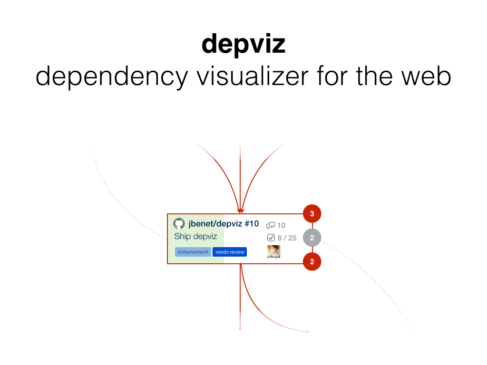
---
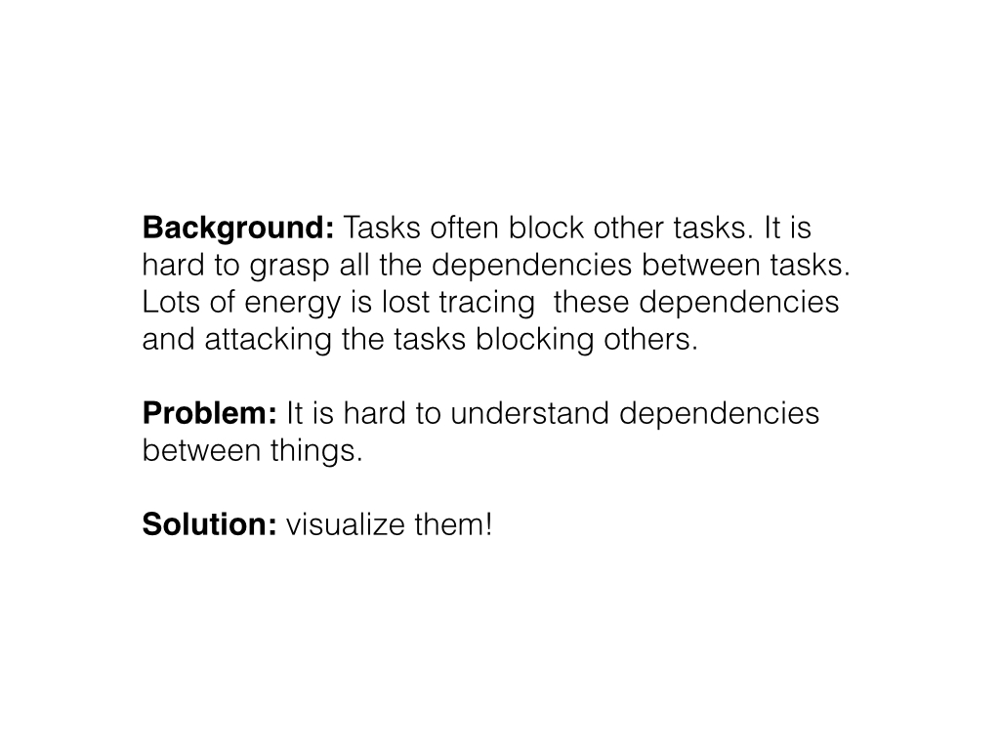
---
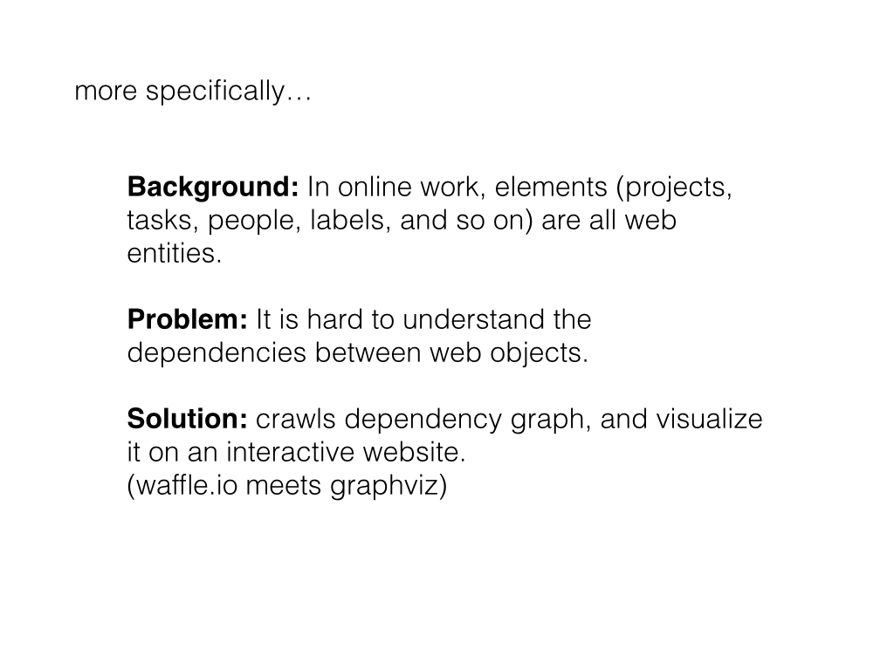
---
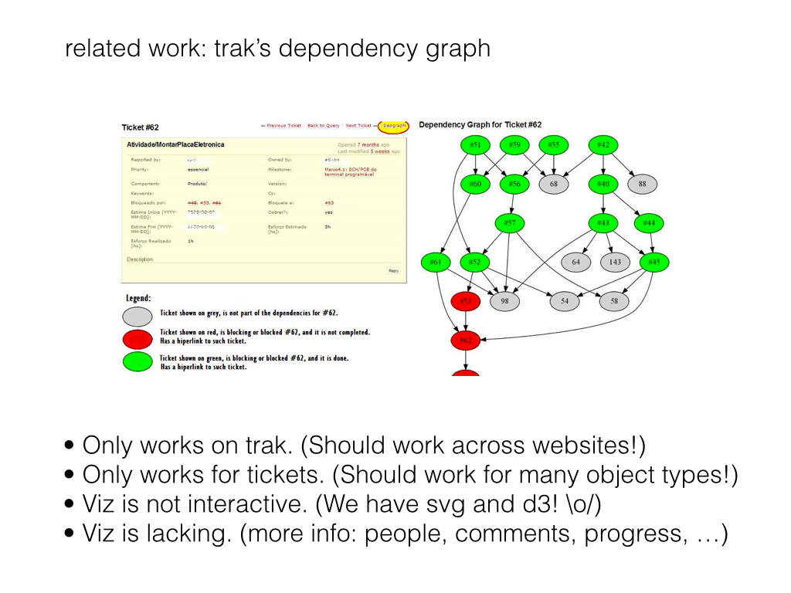
---
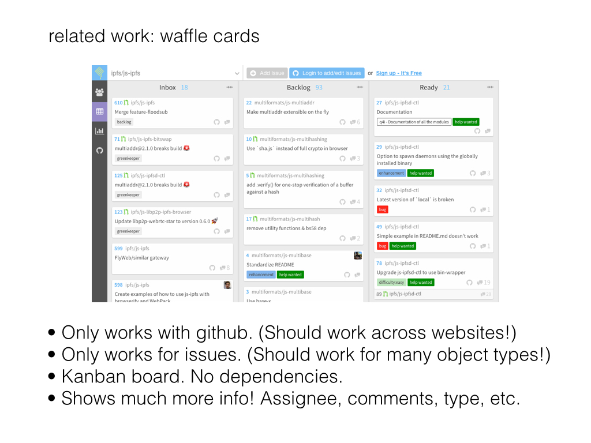
---
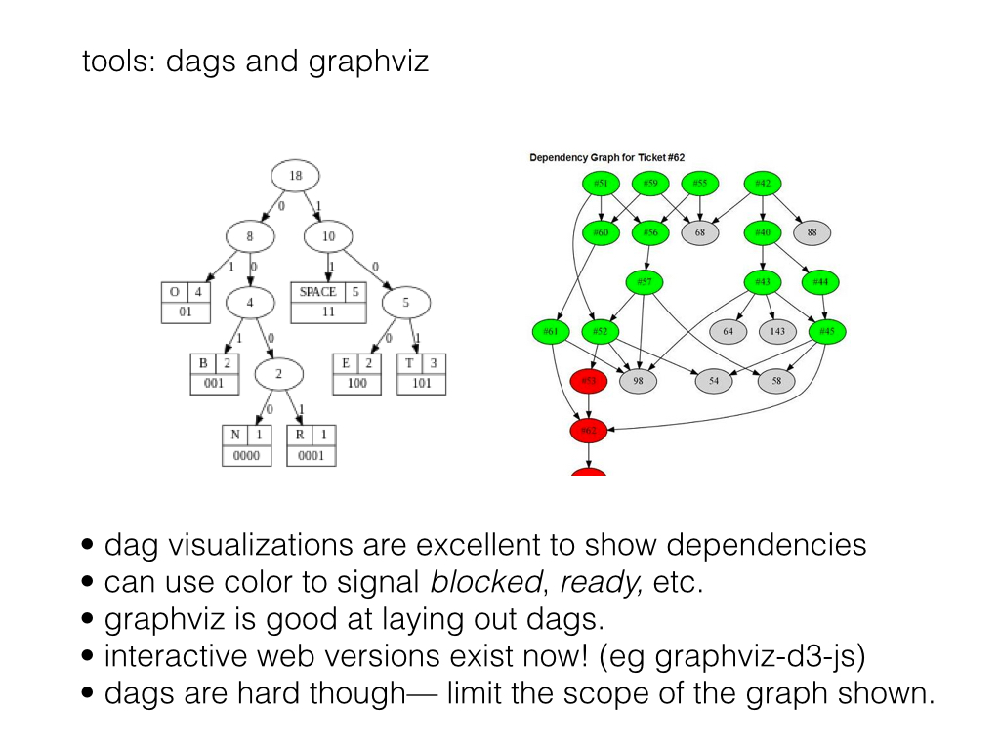
---
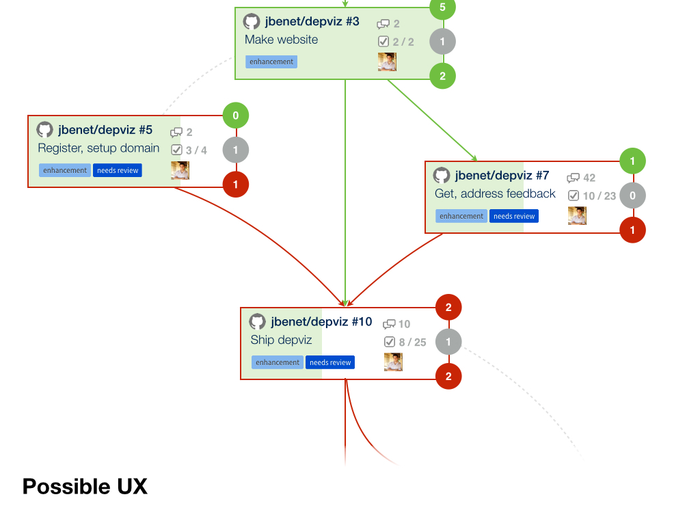
---
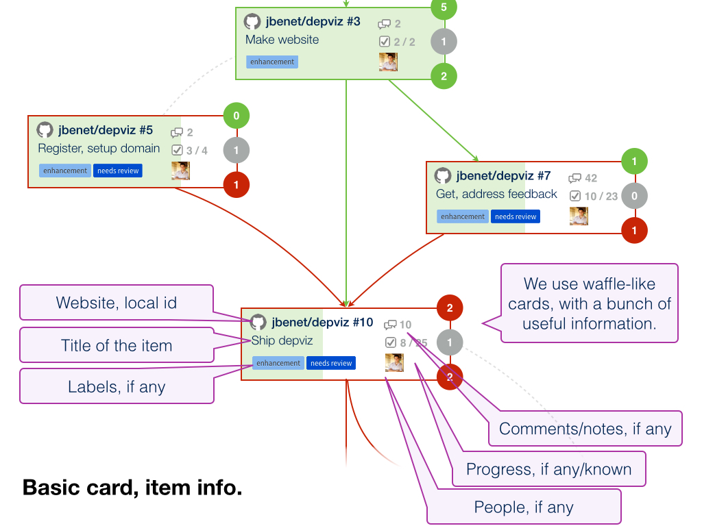
---
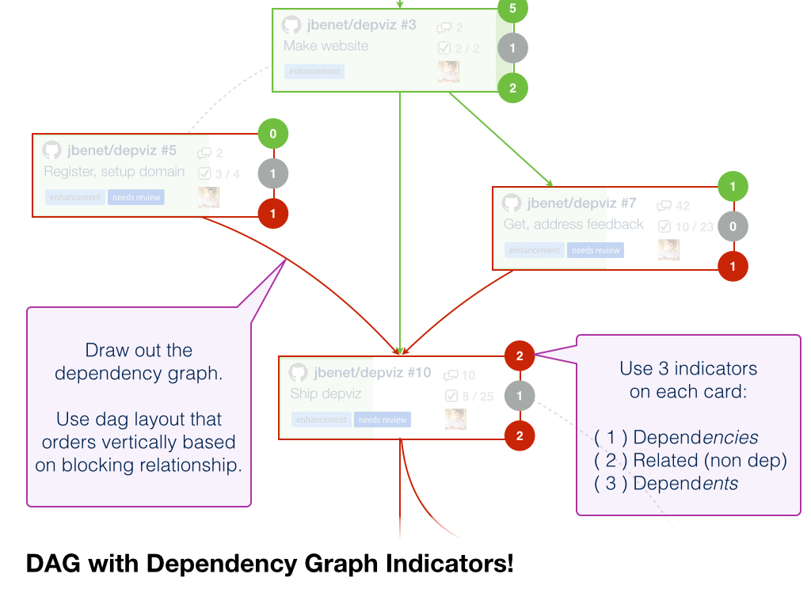
---
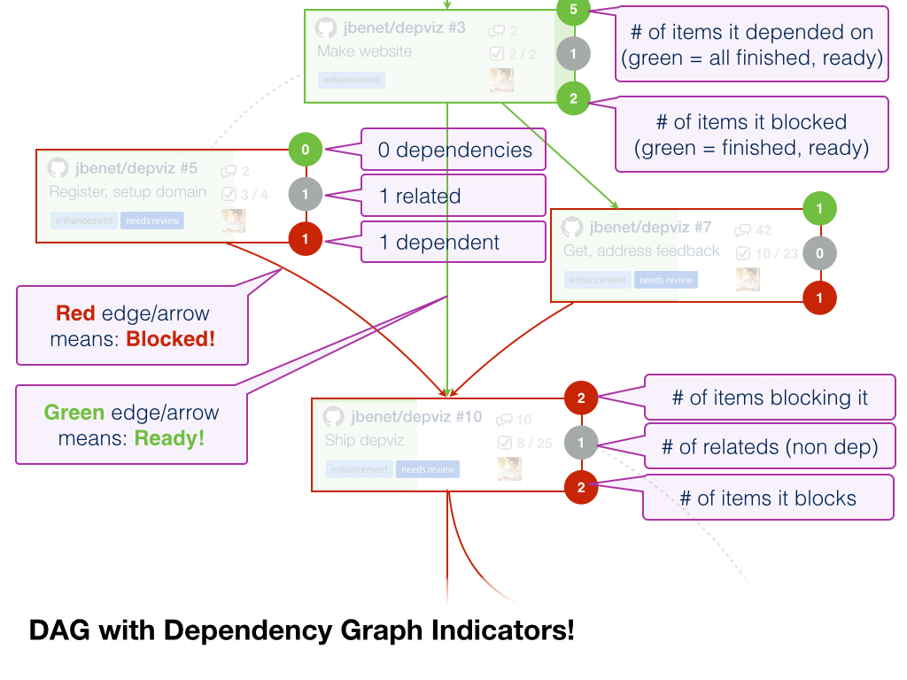
---
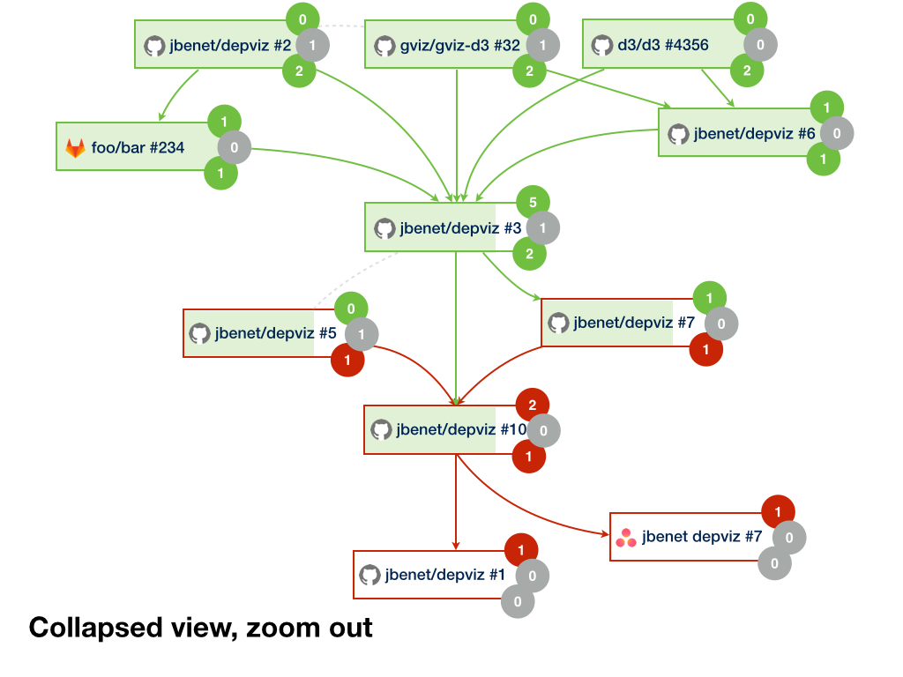
---
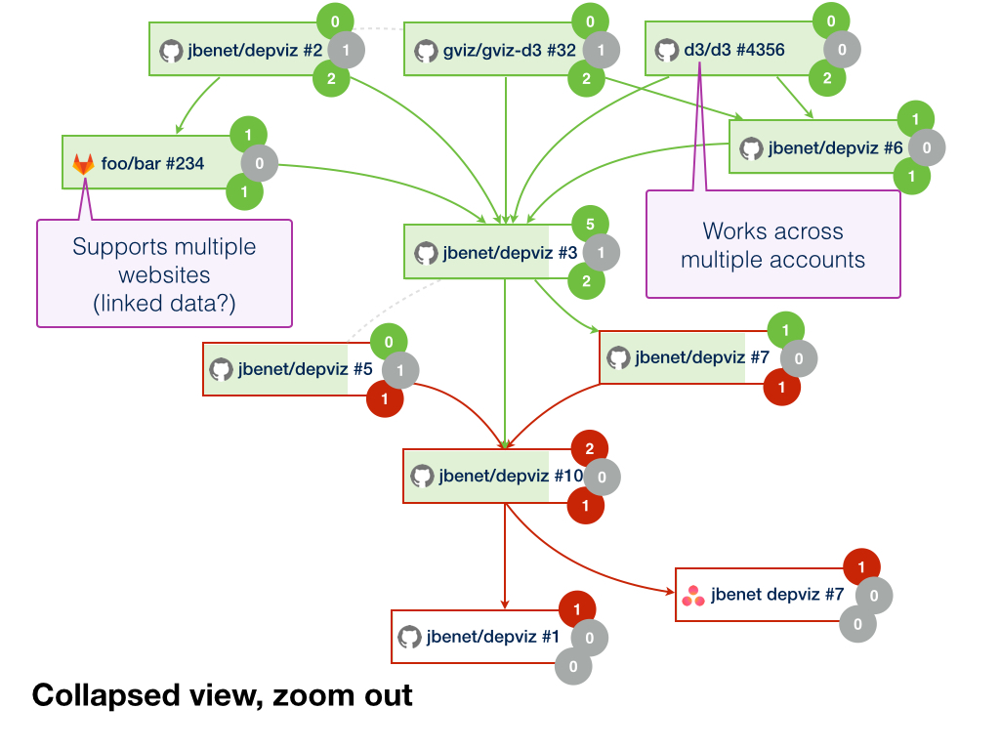

## Contribute

PRs are accepted! Please dive in to [the issues](https://github.com/jbenet/depviz/issues), too.

Please be aware that all interactions related to depviz are subject to the IPFS [Code of Conduct](https://github.com/ipfs/community/blob/master/code-of-conduct.md).

## License

[MIT](LICENSE) © 2016 depviz contributors
